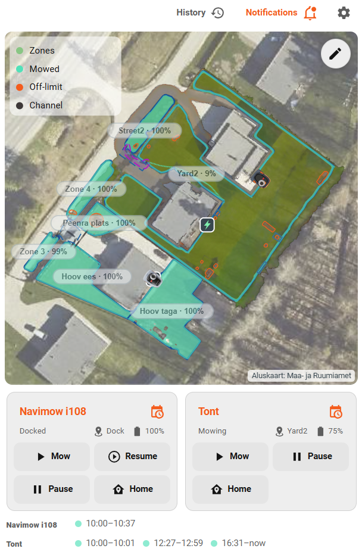

# Navimower Map Card



A Home Assistant dashboard card for the [`Navimower`](https://github.com/vahesoo/NaviMower) custom integration. It combines the live mower map, current mowing cycle, history, notifications, mower controls, scheduling and selected device settings in one responsive card.

> [!IMPORTANT]
> This card is designed for the **Navimower** integration and uses `custom:navimower-map-card`.

## Features

- **Current cycle map** — the default view renders the integration-prepared `current_cycle_render`, so each zone shows only the mowing area from its latest confirmed mowing cycle.
- **History** — previous completed sessions stay available by day and can be highlighted without being mixed into the default current-cycle view.
- **Live mower position** — MQTT-backed position and heading with model-aware mower artwork for H1/H2, i-series, i2 LiDAR, X3 and X4 families.
- **Mower controls** — conditional Resume plus Mow, Pause and Dock controls.
- **Mow now** — select zones in order and choose whether to restart the selected mowing area or continue remaining progress.
- **Notifications** — compact retained Navimow notifications with unread state, per-message read action and Mark all as read.
- **Schedule** — supports both the native Navimow schedule and the integration-owned Navimower schedule.
- **Settings** — optional quick access to selected Home Assistant entities from the mower device.
- **Map geometry** — zones, Off-limit areas, VF-off areas, Channels, Gate areas, charging station and integration-defined Custom Areas.
- **Visual editor** — grouped Displayed information, Appearance and Colors settings with native Home Assistant controls.
- **Configurable header** — History, Notifications, Schedule and Settings buttons can be shown or hidden independently.
- **Error feedback** — the mower icon gets a red pulsing glow while the `lawn_mower` entity reports an error.
- **Zoom and pan** — mouse wheel, pinch zoom, pan, initial focus and optional browser-side view memory.
- **Performance-oriented rendering** — expensive current-cycle geometry is prepared by the Navimower integration; the card primarily renders the prepared SVG and updates only the live layers that changed.

## Requirements

- Home Assistant 2026.6 or newer
- [`Navimower`](https://github.com/vahesoo/NaviMower) integration
- A recent Navimower release is strongly recommended. The current-cycle SVG view and managed scheduler require integration support for those features.
- HACS is recommended for installation and updates.

## Installation with HACS

1. Open **HACS**.
2. Open the three-dot menu and choose **Custom repositories**.
3. Add this repository as category **Dashboard**.
4. Open **Navimower Map Card** and choose **Download**.
5. Refresh the Home Assistant frontend.

HACS installs the single runtime resource automatically:

```text
dist/navimower-map-card.js
```

## Quick start

Only the mower entity is normally required:

```yaml
type: custom:navimower-map-card
entity: lawn_mower.my_mower
```

With `auto_entities: true` the card discovers the related Navimower map, position, heading, battery, zone, notification and scheduler entities from the same Home Assistant device.

## Current cycle and History

The default map is **Current cycle**, not a union of every mowing session from the current day.

For every zone, the Navimower integration decides where the latest confirmed mowing cycle begins. A pause, charging stop, Home Assistant restart or `reset=false` continuation stays in the same cycle. A confirmed new cycle/reset clears only that zone's older mowing area from the default view. Older completed sessions are not deleted; they remain available under **History**.

The integration provides the prepared SVG through:

```text
current_cycle_render.mowed_area.path_d
```

The card renders that backend-prepared area directly. It does not reconstruct mowing cycles in the browser.

Clicking a History session highlights the selected completed session. `history_days` controls how many calendar days are available in the History selector.

## Mower controls

### Resume

When the installed Navimower integration reports a resumable retained task, **Resume** calls `navimower.resume`. It does not create a new mowing cycle.

### Mow

**Mow** opens the integrated Mow now dialog. You can:

- select one or more zones;
- tap zones in the desired order;
- leave all zones unselected to let the mower choose its route;
- restart the selected mowing area or continue remaining progress.

### Pause and Dock

**Pause** pauses the mower task and **Dock** sends the mower to the charging station.

## Schedule

The Schedule button supports two schedule sources:

- **Native schedule** — the weekly schedule stored by Navimow.
- **Navimower schedule** — the integration-owned time-window/queue scheduler.

The Schedule button is orange whenever **either** schedule is enabled.

### Set up the Navimower schedule first

The Navimower scheduler belongs to the integration, not to the card. Configure it first from the mower's Home Assistant **Device** page:

1. Open **Settings → Devices & services → Navimower**.
2. Open the mower device.
3. Configure the Navimower schedule entities/options for the desired time window, order and zones.
4. Enable the Navimower schedule when the configuration is ready.

After that, the card's **Schedule** button can open the managed scheduler interface, where the current time window and custom zone order can be viewed and adjusted. The card sends changes back through Navimower Home Assistant actions/entities; it does not run a second browser-side scheduler.

If the Navimower schedule is disabled, the Schedule button can still open the native Navimow schedule according to the selected Schedule view mode.

The integration defines the scheduler runtime behavior. In current releases, disabling the Navimower schedule pauses scheduler ownership without erasing its runtime state; enabling it resumes the scheduler. A deliberate scheduler reset is a separate integration action.

## Notifications

The Notifications button uses the Navimower retained notification feed. It can show unread state, expand message bodies and call the integration's read actions:

```text
navimower.mark_notification_read
navimower.mark_all_notifications_read
```

The card never calls the Navimow cloud directly. Notification state and account scoping remain integration responsibilities.

## Settings button

The optional Settings button opens the Home Assistant entities selected in the card editor. Use it for the mower settings you want available directly from the dashboard without duplicating their logic in the card.

## Map areas

The map uses Navimow/Navimower terminology:

- **Zone** — mowing area
- **Off-limit** — mapped area the mower must not enter
- **VF-off** — area where VisionFence obstacle detection is disabled
- **Channel** — route connecting mowing zones
- **Gate area** — Navimower gate/interlock geometry
- **Custom area** — integration-defined Home Assistant area overlay

Custom Areas can be shown or hidden independently. Their fill opacity, border width and color are configured under the same Appearance/Colors groups as the other map geometry.

## Visual defaults

New cards start with a clean, thin-line map style. These are the main visual defaults:

| Setting | Default |
| --- | ---: |
| Map background | `#ffffff` |
| Map legend opacity | `0.10` |
| Zone fill | `#81c784` / `0.20` |
| Zone border | `#43a047` / `1.5` |
| Mowed area | `#43a047` / `0.50` |
| Off-limit | `#FF5A00` / `1.5` |
| VF-off | `#2F80ED` / `1.5` |
| Channel | `#808080` / `1.5` |
| Gate area | `#8e24aa` / `1.5` |
| Dock | `#37474f` / `1.5` |
| Custom area | `#8e24aa`, fill `0.10`, border `1.5` |
| Zone label opacity | `0.75` |
| Mower scale | `1.2` |
| Dock scale | `1.1` |
| Zone marker scale | `1.1` |

All map border-width controls, including **Custom area border width**, use sliders in the visual editor.

## Example YAML

The visual editor is recommended, but the same settings can be configured in YAML:

```yaml
type: custom:navimower-map-card
entity: lawn_mower.my_mower
auto_entities: true

show_status: true
show_zone: true
show_battery: true
show_position: false
show_zone_labels: true
show_channels: true
show_vf_off_areas: true
show_gate_areas: true
show_custom_areas: true
show_map_legend: true
show_session_legend: true

enable_zoom: true
initial_zoom: 1
initial_focus: map
remember_view: false
max_zoom: 8

map_background_color: "#ffffff"
map_legend_opacity: 0.10
zone_label_font_size: 20
zone_label_opacity: 0.75

zone_fill_color: "#81c784"
zone_fill_opacity: 0.20
zone_stroke_color: "#43a047"
trail_color: "#43a047"
trail_opacity: 0.50
off_limit_color: "#FF5A00"
vf_off_color: "#2F80ED"
channel_color: "#808080"
gate_area_color: "#8e24aa"
dock_color: "#37474f"
custom_area_color: "#8e24aa"
custom_area_fill_opacity: 0.10

zone_stroke_width: 1.5
off_limit_stroke_width: 1.5
vf_off_stroke_width: 1.5
channel_stroke_width: 1.5
gate_area_stroke_width: 1.5
dock_stroke_width: 1.5
custom_area_stroke_width: 1.5

mower_scale: 1.2
dock_scale: 1.1
zone_marker_scale: 1.1
```

## Visual editor

The editor groups related settings so the same type of setting stays in one place:

- **Displayed information** — map elements, Custom Areas and header-button visibility.
- **Appearance** — opacity, scale, marker and border-width controls.
- **Colors** — map and area colors.
- **Notifications** — retained-notification display options.
- **Schedule button** — choose Automatic, Navimower or Native schedule view behavior.
- **Settings** — choose the mower device entities exposed by the Settings button.

## Frontend performance

The card deliberately keeps expensive work out of the browser where possible:

- static map geometry is cached by map revision and visual configuration;
- current-cycle mowing area is prepared by the Navimower integration;
- completed History sessions use backend-prepared SVG archives;
- live position/heading updates only the mower/live layers;
- footer, controls, Schedule and Notifications update independently;
- render requests in the same browser frame are coalesced.

This architecture keeps large histories and long mowing sessions from turning the dashboard card into the source of map-processing load.

## Updating and cache troubleshooting

After a HACS update, Home Assistant may still have the previous JavaScript resource in browser cache. If a new editor option or visual change does not appear:

1. refresh the Home Assistant frontend;
2. on mobile, fully close and reopen the Home Assistant app if necessary;
3. on desktop, perform a hard refresh if the old card runtime is still cached.

The current card version is also printed in the browser console as `NAVIMOWER-MAP-CARD`.

## Development

Source runtime:

```text
src/navimower-map-card.js
```

HACS runtime:

```text
dist/navimower-map-card.js
```

Before release, the repository's deterministic build and regression suite verify both generated runtime files, editor contracts, scheduler behavior, current-cycle rendering and HACS compatibility.

## Issues and contributions

Bug reports and feature requests are welcome in this repository's GitHub Issues. When reporting a map/rendering issue, include the Navimower integration version, Map Card version, mower model and a screenshot where possible.
