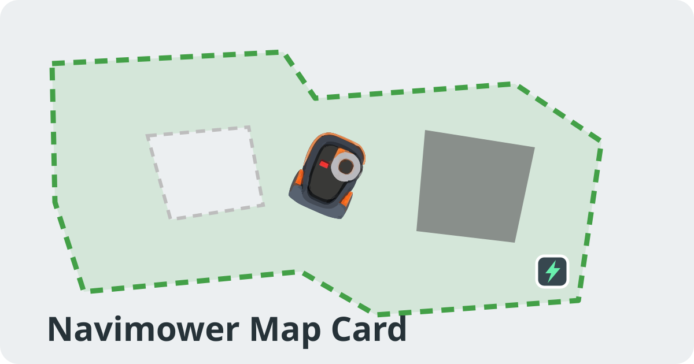

# Navimower Map Card



A Home Assistant dashboard card for the [`Navimower`](https://github.com/vahesoo/NaviMower) custom integration.

It combines the mower map, live MQTT position, mowing history, direct mower controls, ordered zone mowing, and weekly schedule editing in one HACS-managed Lovelace card.

> [!IMPORTANT]
> This card is built for the **Navimower** integration and uses the custom element `custom:navimower-map-card`.
> It is not the older `Navimow Map Card` made for the previous integration.

## Highlights

- Decoded Navimow map geometry with zones, Off-limit areas, VF-off areas, Channels, Gate areas, and charging station
- Live MQTT mower position and heading
- Day-based map history for Today and the two preceding dates
- Three-day History selector with matching routes and session times for each day
- Gap-aware trail segments for pauses, integration reloads, and Home Assistant restarts
- Clickable session times that briefly pulse the selected session route at the original three-pulse tempo
- Interactive zone labels with progress, mowing times, and cutting height when the mower supports automatic height control
- Automatic zone-label decluttering so nearby zone markers no longer cover each other
- Optional VisionFence / VF-off geometry visibility for cleaner perimeter-style maps
- Cached static map geometry and selective live-layer updates for faster dashboard reopening
- Automatic filtering of completed history records that contain no drawable route
- Mow, Pause, and Dock controls directly below the map
- Integrated **Mow now** dialog with ordered zone selection and progress reset/continue choice
- Integrated weekly **Schedule** editor
- Automatic related-entity discovery from one `lawn_mower` entity
- Visual card editor and optional YAML configuration
- Mouse-wheel zoom, pinch zoom, pan, configurable initial focus, and optional browser-side view memory
- Home Assistant Sections-view sizing
- No external JavaScript dependencies

## Requirements

- Home Assistant 2026.6 or newer
- [`Navimower`](https://github.com/vahesoo/NaviMower) integration
- Navimower v0.2.9 or newer is recommended for dense battery telemetry, stable counters and channel state, supported cutting-height detection, and three-day history
- HACS is recommended for installation and updates

## Installation with HACS

1. Open **HACS**.
2. Open the three-dot menu and choose **Custom repositories**.
3. Add this repository as category **Dashboard**.
4. Open **Navimower Map Card** and choose **Download**.
5. Refresh the Home Assistant frontend.

HACS installs and registers the card resource automatically. You do not need to add a Lovelace resource manually.

The distributed frontend file is:

```text
dist/navimower-map-card.js
```

## Basic configuration

Normally only the mower entity is required:

```yaml
type: custom:navimower-map-card
entity: lawn_mower.tont
```

The card automatically looks for related Navimower entities on the same Home Assistant device, including:

- map data
- position X and Y
- heading
- battery
- current physical zone
- mowing schedule

Every detected entity can be overridden in the visual editor or YAML.

## What the card controls

### Mow, Pause, and Dock

The card includes three direct mower controls below the map.

- **Mow** resumes an active paused job immediately.
- When no resumable job exists, **Mow** opens the integrated Mow now dialog.
- **Pause** pauses the current mower task.
- **Dock** sends the mower to the charging station.

### Mow now

The Mow now dialog supports:

- selecting one or more zones
- choosing the mowing order by tapping zones in sequence
- leaving all zones unselected to let the mower choose its own order
- clearing previous mowing progress or continuing the remaining area

The selected zone IDs are sent to `navimower.mow` in the same order in which the zone buttons were pressed.

### Schedule

The **Schedule** button in the card header opens the weekly schedule editor.

- Orange (`#FF5A00`): at least one enabled mowing period exists
- Grey: the schedule is off, empty, or unavailable

The editor supports:

- enabling and disabling weekdays
- multiple mowing periods per day
- 15-minute start and end time steps
- all zones or selected zones for each period
- separate Save and Discard actions for each weekday

Schedule changes are saved through `navimower.set_schedule`. No separate scheduler card or JavaScript resource is required.

## Map terminology

The card uses the same concepts as the Navimow app:

- **Off-limit** — mapped areas the mower must not enter
- **VF-off** — areas where VisionFence obstacle detection is disabled
- **Channel** — Navimow routes connecting mowing zones
- **Gate area** — local Home Assistant rectangles used by gate/interlock logic

The relevant map payload fields are:

```json
{
  "map": {
    "off_limit_areas": [],
    "vf_off_areas": [],
    "channels": []
  },
  "gate_areas": []
}
```

## Today and three-day history

The default map is **Today**. It shows the retained mowing routes and session times from the current calendar day, including the live active trail. The **History** button in the card header offers three day choices:

- Today
- the previous date in compact `DD.MM` format
- the date two days ago in compact `DD.MM` format

For example, on 31 August the choices are **Today**, **30.08**, and **29.08**. Selecting an earlier date filters both the map routes and session buttons to that calendar day. This intentionally keeps the interface simple; multiple sessions on the same day are displayed together and remain individually selectable from the session row.

Clicking a session time draws that session temporarily above the selected map and pulses it three times. The original 600 ms pulse speed is retained, while `forwards` fill mode removes the brief extra color flash after the third pulse.

Use these settings for the mowed area:

```yaml
trail_color: "#43a047"
trail_opacity: 0.55
```

There are no separate active-trail or old-trail color and opacity controls.

Navimower v0.2.6 map API schema v4 returns cycle-aware sessions and separate route fragments:

```json
{
  "schema_version": 4,
  "trail_segments": [
    [[1.2, 3.4], [1.3, 3.5]],
    [[4.1, 5.2], [4.2, 5.3]]
  ],
  "sessions": [
    {
      "id": "session-1",
      "started_at": "2026-07-30T16:15:00+03:00",
      "ended_at": null,
      "active": true,
      "segments": [
        [[1.2, 3.4], [1.3, 3.5]],
        [[4.1, 5.2], [4.2, 5.3]]
      ]
    }
  ]
}
```

The card renders every segment separately so missing position data during a pause, reload, or restart does not create a false straight line. Intentional cycle boundaries remain separate even when the next cycle starts within five minutes. Completed backend session stubs with no drawable route are filtered out, while a newly active session remains visible until its route has enough points to be selected. The older flat `trail` and `points` fields remain supported as a fallback.

Session and zone-detail times follow the current Home Assistant user's 12-hour or 24-hour time preference.

## Interactive zone details

Click or tap a zone label to view available information:

- current or last reported coverage percentage
- last mowing time
- last completed time
- cutting height

Exact timestamps depend on the `zone_details` data supplied by the Navimower integration. Missing values are shown as **Not available** rather than reconstructed in the browser.

When nearby zone labels would overlap, the card moves the minimum number of labels to free positions and draws a subtle leader line back to the original zone anchor. This behavior is enabled by default and can be disabled with `avoid_zone_label_overlap: false`.

VisionFence / VF-off polygons are shown by default. Users who keep VisionFence enabled only around a perimeter and use a large VF-off area in the middle can hide that geometry and its legend row without changing mower data or behavior:

```yaml
show_vf_off_areas: false
```

See [docs/SESSION_API.md](docs/SESSION_API.md) for the supported map API fields.

## Zoom and navigation

- Mouse wheel: zoom at the pointer position
- Two-finger pinch: zoom on mobile
- One-finger drag: pan while zoomed in
- Double-click or double-tap: reset to the configured initial view
- At 1x zoom, vertical touch gestures remain available for dashboard scrolling

Example:

```yaml
type: custom:navimower-map-card
entity: lawn_mower.tont
initial_zoom: 1.4
initial_focus: mower
remember_view: false
```

`initial_focus` accepts:

- `map`
- `mower`
- `dock`

When `remember_view` is enabled, the view is stored only in that browser's local storage.

## Appearance

The visual editor exposes the current display and appearance settings. A representative YAML configuration is:

```yaml
type: custom:navimower-map-card
entity: lawn_mower.tont
title: Navimower Map

auto_entities: true
show_status: true
show_zone: true
show_battery: true
show_position: false
show_zone_labels: true
avoid_zone_label_overlap: true
show_vf_off_areas: true
show_channels: true
show_gate_areas: true
show_map_legend: true
show_session_legend: true
session_count: 6

enable_zoom: true
initial_zoom: 1.25
initial_focus: map
remember_view: true
max_zoom: 8

map_background_color: "#e6e6e6"
map_legend_opacity: 0.58
zone_label_font_size: 20
zone_label_opacity: 0.8

zone_fill_color: "#81c784"
zone_fill_opacity: 0.22
zone_stroke_color: "#43a047"
trail_color: "#43a047"
trail_opacity: 0.55
off_limit_color: "#FF5A00"
vf_off_color: "#2F80ED"
channel_color: "#686868"
gate_area_color: "#8e24aa"
dock_color: "#37474f"
```

Leaving `map_background_color` empty uses the current Home Assistant theme's secondary background color.

## Frontend performance

The card separates static map content from live telemetry. Zone geometry, Off-limit and VF-off polygons, Channels, Gate areas, the charging station, legend, and resolved zone-label positions are cached in browser memory by map revision and visual configuration. Returning to the same dashboard can therefore restore the prepared base map immediately instead of normalizing and laying out all geometry again.

The live update path watches only the entities used by the card:

- position or heading changes update the mower transform and active trail
- status, zone, or battery changes update only the footer
- mower availability changes update only the existing controls
- schedule changes update only the schedule state and open editor
- unrelated Home Assistant entity updates cause no card redraw

The static card template and embedded mower artwork are parsed once per loaded frontend module. The mower SVG and Mow, Pause, and Dock buttons remain mounted and are updated in place rather than being recreated for every telemetry event. Render requests arriving in the same browser frame are coalesced.

Cached map payloads use stale-while-revalidate behavior: the prepared map is restored immediately, and an older cache entry is refreshed from the integration in the background. Cache entries are bounded in memory and map/configuration changes create a new cache key.

## Manual entity overrides

Overrides take precedence over automatic discovery:

```yaml
type: custom:navimower-map-card
entity: lawn_mower.tont
map_entity: sensor.tont_map_data
x_entity: sensor.tont_position_x
y_entity: sensor.tont_position_y
heading_entity: sensor.tont_heading
battery_entity: sensor.tont_battery
zone_entity: sensor.tont_current_physical_zone
schedule_entity: sensor.tont_schedule
```

The selected mower entity is used as the status entity unless `status_entity` is explicitly set.

## Removed legacy options

The card has evolved from separate trail styles and experimental doodle rendering to the current unified map view. These options are no longer used:

```yaml
history_trail_min_opacity:
history_trail_max_opacity:
show_doodles:
doodle_opacity:
```

The old standalone Mow now and Scheduler cards are also unnecessary. Both interfaces are included in `navimower-map-card.js`.

Existing YAML containing removed keys will still load, but those keys have no effect and can be deleted.

## Troubleshooting

### `Custom element doesn't exist: navimower-map-card`

Confirm that HACS installed the dashboard card and created the resource:

```text
/hacsfiles/navimower-map-card/navimower-map-card.js
```

Then refresh the frontend. On Android, clear the Home Assistant app or WebView cache if an older resource remains loaded.

### Map entity cannot be found

Select the mower entity in the visual editor and keep automatic discovery enabled. Use manual entity overrides only when related entities are attached to another Home Assistant device or have unusual entity IDs.

### Map API error

Verify that the Navimower integration is loaded and that its map-data sensor is available. The card uses the authenticated `api_path` from the map-data sensor or `map_api_path` from the mower entity.

### Schedule button remains grey

Check that the schedule sensor is available and contains at least one enabled day with a mowing period. Set `schedule_entity` manually when automatic discovery does not find it.

## Development

The project has no runtime dependencies.

```bash
npm test
```

Edit the source file:

```text
src/navimower-map-card.js
```

Rebuild the HACS distribution file:

```bash
npm run build
```

Commit both the source and generated `dist/navimower-map-card.js` files.

## Current limitations

- Multi-mower configurations need broader real-world testing.
- Doodle geometry remains available through the integration but is intentionally not rendered until its native world scale can be determined reliably.
- Command labels and dialog text are currently English-only.

## Disclaimer

This project is not affiliated with or supported by Segway, Ninebot, Navimow, or Willand. A robot mower is a moving machine with a cutting blade. Test remote commands and automations safely.

## License

MIT License. Created by **Toomas Vähesoo**.
